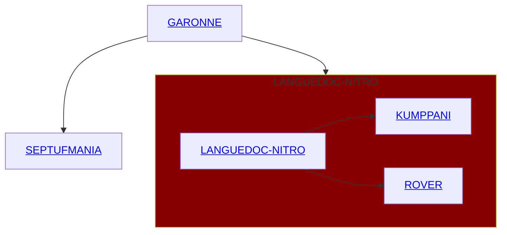

  <picture>
    
  </picture>

  
  
  
  
  <a href="https://github.com/Septimania/septimania/blob/main/README_IT.md"><a>
  
  
  
  
  
  
  
  
  
  
  
  
  
  
  
  
  
  
  
  
  
  
  
  
  
  
  
  
  
  
  
  
  
  
  

  

$$
{\color{#C40026}\Huge{\textsf{SEPTIMANIA}}}
$$

Languedoc-Roussillon on Ranskan alue, jolla on runsaasti historiaa, kulttuuria ja upeita maisemia. Siksi olen kehittäjä, jolla on intohimo tätä aluetta kohtaan. 

Ihailuni Languedoc-Roussillonin aluetta kohtaan näkyy myös intohimossani tietokoneiden kehittämiseen. Kehittäjänä pyrin ohjelmointitaitojeni avulla edistämään ja parantamaan tämän alueen arvostusta. 

Etsin jatkuvasti luovia tapoja käyttää teknologiaa Languedoc-Roussillonin ainutlaatuisten puolien esittelemiseen. Olipa kyse sitten mobiilisovellusten luomisesta matkailijoiden auttamiseksi tutustumaan alueeseen, verkkosivujen kehittämisestä paikallisten tuotteiden markkinoimiseksi tai digitaalisten työkalujen suunnittelusta paikallisten ihmisten kokemusten parantamiseksi, olen sitoutunut käyttämään kehitystaitojani tämän alueen rikkauksien esittelemiseen. 

Languedoc-Roussillonin alueeseen intohimoisesti suhtautuvana kehittäjänä pyrin myös pysymään ajan tasalla uusimmista teknologisista suuntauksista ja innovaatioista, jotta voin integroida ne tehokkaasti hankkeisiini. Otan mielelläni vastaan haasteita ja etsin innovatiivisia ratkaisuja, jotka vastaavat asiakkaideni tarpeita ja tarjoavat poikkeuksellisen käyttäjäkokemuksen. 

Lyhyesti sanottuna kehittäjänä, jolla on intohimo Languedoc-Roussillonin aluetta kohtaan, olen päättänyt käyttää taitojani ja intohimoani teknologiaa kohtaan tämän upean alueen edistämiseksi ja kehittämiseksi ja auttaa kehittämään innovatiivisia hankkeita ja luomaan ainutlaatuisia digitaalisia kokemuksia.

<h3 align="center">Osaamisalueeni :</h3>

 

 

 

 

  Kiitos LANGUEDOC-NITRO- ja SEPTUFMANIA-läppäreille. Puhumattakaan GARONNE NAS:sta, joka tarjoaa heille valtavan tallennustilan, voimme suorittaa kaikenlaisia tietotekniikkaan liittyviä tehtäviä.
   
  
   
  Tässä linkit heidän sivuilleen:
   

  On ihan hyvä, että pystyy tekemään paljon asioita yksin, mutta emme saa unohtaa, että joukoissa on voimaa. 
  Siksi on tärkeää tuntea paikallisesti asennetut toimisto-ohjelmistot, mutta myös vaihtoehdot, jotka mahdollistavat yhteistoiminnallisen työskentelyn. 
  Tässä on esimerkki paikallisista toimisto-ohjelmistoista ja niiden online-vastaavista:  
  
   
  

    <table>
      <tbody>
        <tr>
          <td align="center" style="text-align:center;">
            Ohjelmistotyyppi
          </td>
          <td align="center" style="text-align:center;">
            Paikallisesti käytettävät ohjelmistot
          </td>
          <td align="center" style="text-align:center;">
            Verkkomääräinen vastaava
          </td>
        </tr>
        <tr>
          <td align="center" style="text-align:center;">
            Tekstinkäsittely
          </td>
          <td align="center" style="text-align:center;">
            Microsoft Word
          </td>
          <td align="center" style="text-align:center;">
            Google Docs
          </td>
        </tr>
        <tr>
          <td align="center" style="text-align:center;">
            Taulukkolaskenta
          </td>
          <td align="center" style="text-align:center;">
            Microsoft Excel
          </td>
          <td align="center" style="text-align:center;">
            Google Sheets
          </td>
        </tr>
        <tr>
          <td align="center" style="text-align:center;">
           Diaesityksen luoja
          </td>
          <td align="center" style="text-align:center;">
            Microsoft PowerPoint
          </td>
          <td align="center" style="text-align:center;">
            Google Slides
          </td>
        </tr>
        <tr>
          <td align="center" style="text-align:center;">
            Lomaketoimittaja ja lomakkeen täyttäjä
          </td>
          <td align="center" style="text-align:center;">
            Microsoft Infopath
          </td>
          <td align="center" style="text-align:center;">
            Google Forms
          </td>
        </tr>
        <tr>
          <td align="center" style="text-align:center;">
            Muistiinpano-ohjelmisto
          </td>
          <td align="center" style="text-align:center;">
            Microsoft One Note
          </td>
          <td align="center" style="text-align:center;">
            Google Keeps
          </td>
        </tr>
      </tbody>
    </table>
  

 
 
 
